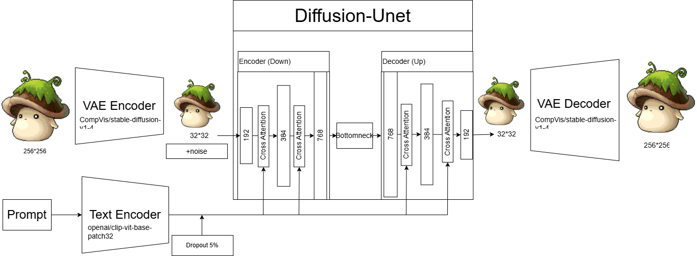

# Conditional Image Generation on Artale Character Images

---
Project: Conditional Image Generation on Artale Character Images

Author: CHOU CHIA-HSUAN

Date: 2025-06-19

Course: Generative AI

---
# 1. Data Preprocessing
We first identify the main character in each image (i.e., non-white regions), crop it into a square shape, pad the borders if needed, and finally resize it to 256×256 resolution. This ensures the character remains centered and clearly visible in the image.

# 2. Train Process 

* Epochs: 60
* Learning Rate: 2×10⁻⁴
* Batch Size: 64
* Classifier-Free Guidance: During training, 5% of prompts are replaced with empty strings to enhance guidance ability at inference.
* UNet Architecture: Used as the denoising network, consisting of 3 Down and 3 Up blocks. Each block incorporates Cross-Attention layers to integrate text embeddings provided by the CLIP Encoder.
* Optimizer: AdamW
* Learning Rate Scheduler: Cosine schedule with warmup for the first 5% of steps
* EMA: Exponential Moving Average weights (decay = 0.998) are used during inference to improve stability and generation quality

# 3. Experimental Analysis

| Method   | Steps | Guidance | FID ↓       | CLIP-Text ↑ | CLIP-Image ↑ |
| -------- | ----- | -------- | ----------- | ----------- | ------------ |
| **DDPM** | 10    | 2        | 63.436      | 0.2970      | —            |
| **DDPM** | **10**    | **3**        | **59.8987**     | **0.2994**      | **0.8246**       |
| **DDPM** | 10    | 4        | 60.608      | 0.2993      | —            |

| Method   | Steps | Guidance | FID ↓       | CLIP-Text ↑ | CLIP-Image ↑ |
| -------- | ----- | -------- | ----------- | ----------- | ------------ |
| **DDPM** | 10    | 2        | 63.436      | 0.2970      | —            |
| **DDPM** | **15**    | **3**        | **59.6989**     | **0.3008**      | **0.8276**   |
| **DDPM** | 20    | 3        | 59.7125     | 0.3009  | —            |

| Method   | Steps | Guidance | FID ↓       | CLIP-Text ↑ | CLIP-Image ↑ |
| -------- | ----- | -------- | ----------- | ----------- | ------------ |
| DDIM | 10    | 2        | 110.853 | 0.2750  | 0.6960   |

We evaluated six different combinations of generation settings. Among them, **DDPM was used together with the DPMSolverMultistepcheduler** during the generation process.

1. **DDPM outperforms DDIM** in overall generation quality. 

2. Under the same number of steps, Classifier-Free Guidance with a scale of **3** generally yields better results than scales of 2 or 4.

3. When guidance is set to 3, setting the number of steps to **15** achieves the best generation quality. Although the scores for steps = 15 and steps = 20 are similar (FID = 59.6989 vs. 59.7125, CLIP-Text Score = 0.3008 vs. 0.3009), we chose **steps = 15 and guidance = 3** as the final inference setting considering the trade-off with generation time.
